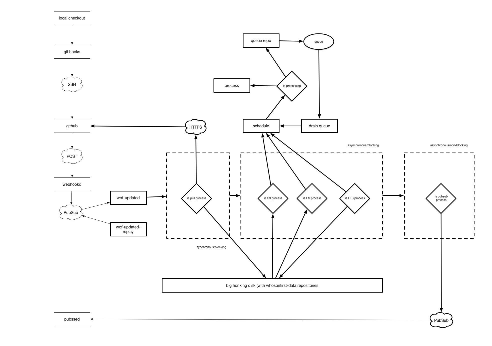

# go-whosonfirst-updated

Too soon. Move along.

## Example

_Complete with formatting errors..._

```
./bin/wof-updated -redis-channel updated
2016/10/26 00:46:43 ready to process tasks
2016/10/26 00:46:43 ready to process pubsub messages
2016/10/26 00:46:43 ready to receive pubsub messages
2016/10/26 01:19:22 got task {whosonfirst-data-venue-us-ca [data/110/872/490/9/1108724909.geojson]}
2016/10/26 01:19:22 buffer whosonfirst-data-venue-us-ca for 30s
2016/10/26 01:19:52 process whosonfirst-data-venue-us-ca [data/110/872/490/9/1108724909.geojson]
2016/10/26 01:19:52 schedule whosonfirst-data-venue-us-ca/data/110/872/490/9/1108724909.geojson
2016/10/26 01:19:52 update metafiles
2016/10/26 01:19:52 pause for %d ms 3.081µs
2016/10/26 01:19:55 sync T38
2016/10/26 01:19:55 pause for %d ms 2.887µs
2016/10/26 01:19:55 sync ES
2016/10/26 01:19:55 pause for %d ms 1.847µs
2016/10/26 01:19:55 sync S3
2016/10/26 01:19:55 pause for %d ms 4.059µs
2016/10/26 01:20:00 processed whosonfirst-data-venue-us-ca
2016/10/26 01:20:00 7.140631659s
2016/10/26 01:20:00 remove /tmp/updated550446686
2016/10/26 01:20:00 All done
```

## Here is a pretty picture



## See also

* https://github.com/whosonfirst/go-webhookd
